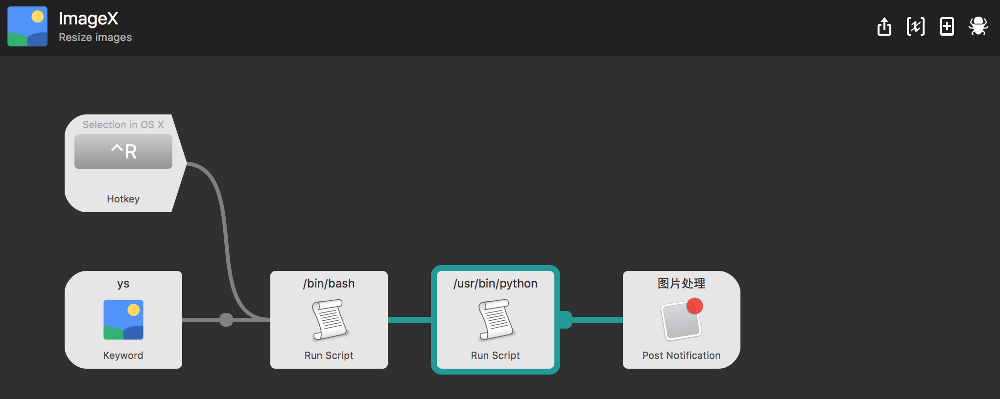

# Alfred.ImageX
A simple workflow to resize selected images through python PIL.

======================

##Install Python library:
1. Install python packages tool [pip](https://github.com/pypa/pip) by: `sudo easy_install pip`
2. Install image library [pillow](https://pypi.python.org/pypi/Pillow) by : `sudo pip install pillow`

##Usage:
1. Define a hotkey, select some images, press the hotkey;
2. Type `ys`;
